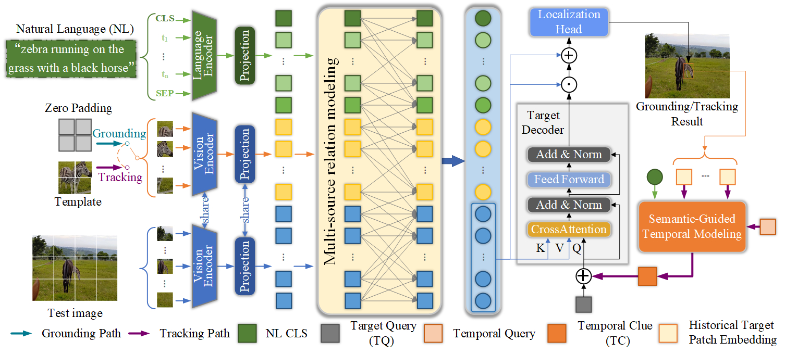

# JointNLT
The official implementation for the **CVPR 2023** paper [_Joint Visual Grounding and Tracking with Natural Language Specification_](https://arxiv.org/abs/2303.12027).

[[Models](https://drive.google.com/drive/folders/1ZKBDhgXgV1GLSzFxw5fqpqdZuX1hjfQe?usp=share_link)][[Raw Results](https://drive.google.com/drive/folders/1vVH3flO4PiWQDfFDAMJjmSHUY0zCXFn7?usp=share_link)][[Poster](https://drive.google.com/file/d/1fJ5BKi-SMzNHUtTqcU9grhvNZGrPfd9G/view?usp=sharing)][[Slide](https://drive.google.com/file/d/1MhajqtjUHRp49EtkzL0h09TXUvkcnc7U/view?usp=sharing)]

## Demo
[](https://drive.google.com/file/d/1P1wx7ag_v2rLIlwgBneg9jzbDPxiAiJb/view?usp=drive_link "JointNLT")
[//]: # (convert the demo link by "https://video-to-markdown.marcomontalbano.com/")

## Framework



## Install the environment
**Option1**: Use the Anaconda (CUDA 11.3)
```
conda create -n joint python=3.7
conda env create -f joint.yaml
conda activate joint
```

**Option2**: Use the Anaconda Pack (CUDA 11.3)
first download the [[Env Package](https://drive.google.com/file/d/1QZeKB3AbClzb2DGzoNudQ4KsXS1LUs_x/view?usp=sharing)]

```
mkdir $USER_ROOT$/anaconda3/envs/joint
tar -xzvf joint.tar.gz -C $USER_ROOT$/anaconda3/envs/joint
conda activate joint
```


## Data Preparation
Put the tracking datasets in ./data. It should look like:
   ```
   ${JointNLT_ROOT}
    -- data
        -- LaSOT
            |-- airplane
            |-- basketball
            |-- bear
            ...
        -- LaSOTTest
            |-- airplane
            |-- bird
            |-- bus
            ...    
        -- LaSOTText
            |-- atv
            |-- badminton
            |-- cosplay
            ...  
        -- TNL2K_train
            |-- Arrow_Video_ZZ04_done
            |-- Assassin_video_1-Done 
            ...
        -- TNL2K_test
            |-- Assian_video_Z03_done
            |-- BF5_Blade_video_01-Done
        --COCO
            |-- images
            |-- refcoco
            |-- refcoco+
            |-- refcocog
        --OTB_sentences
            |-- OTB_query_test
            |-- OTB_query_train
            |-- OTB_videos
   ```

## Set project paths
Run the following command to set paths for this project
```
python tracking/create_default_local_file.py --workspace_dir . --data_dir ./data --save_dir .
```
After running this command, you can also modify paths by editing these two files
```
lib/train/admin/local.py  # paths about training
lib/test/evaluation/local.py  # paths about testing
```

## Train JointNLT
Download the pretrained weight [[BERT pretrained weight](https://drive.google.com/drive/folders/1Fi-4TSaIP4B_TPi2Jme2sxZRdH9l5NPN?usp=share_link)] put it under `$PROJECT_ROOT$/pretrained` .


Training with multiple GPUs using DDP.
```
# JointNLT
python tracking/train.py --script jointnlt --config swin_b_ep300 --save_dir log/swin_ep300 --mode multiple --nproc_per_node 4

```


## Evaluation
- LaSOT/TNL2K/OTB99. 
Download the model weights from [Google Drive](https://drive.google.com/drive/folders/1ZKBDhgXgV1GLSzFxw5fqpqdZuX1hjfQe?usp=share_link) 

Put the downloaded weights on `$PROJECT_ROOT$/checkpoints/`

Change the corresponding values of `lib/test/evaluation/local.py` to the actual benchmark saving paths

### Evaluate initialized by Natural Language (NL):
- LaSOT or other off-line evaluated benchmarks (modify `--dataset` correspondingly)
```
python tracking/test.py jointnlt swin_b_ep300 --dataset lasot --threads 16 --num_gpus 4 --params__model JointNLT_ep0300.pth.tar
python tracking/analysis_results.py --dataset_name lasot --tracker_param swin_b_ep300
```
- TNL2K
```
python tracking/test.py jointnlt swin_b_ep300 --dataset tnl2k --threads 16 --num_gpus 4 --params__model JointNLT_ep0300.pth.tar
python tracking/analysis_results.py --dataset_name tnl2k --tracker_param swin_b_ep300
```
- OTB99
```
python tracking/test.py jointnlt swin_b_ep300 --dataset otb --threads 16 --num_gpus 4 --params__model JointNLT_ep0300.pth.tar
python tracking/analysis_results.py --dataset_name otb --tracker_param swin_b_ep300
```

### Evaluate initialized by Box and Natural Language (NL):
- LaSOT or other off-line evaluated benchmarks (modify `--dataset` correspondingly)
```
python tracking/test.py jointnlt swin_b_ep300_track --dataset lasot --threads 16 --num_gpus 4 --params__model JointNLT_ep0300.pth.tar
python tracking/analysis_results.py --dataset_name lasot --tracker_param swin_b_ep300_track
```
- TNL2K
```
python tracking/test.py jointnlt swin_b_ep300_track --dataset tnl2k --threads 16 --num_gpus 4 --params__model JointNLT_ep0300.pth.tar
python tracking/analysis_results.py --dataset_name tnl2k --tracker_param swin_b_ep300_track
```
- OTB99
```
python tracking/test.py jointnlt swin_b_ep300_track --dataset otb --threads 16 --num_gpus 4 --params__model JointNLT_ep0300.pth.tar
python tracking/analysis_results.py --dataset_name otb --tracker_param swin_b_ep300_track
```

## Evaluate the grounding performance.
*Note:* We perform the grounding on the val of refcocog to show our method grounding performance.

```
# Profiling swin_b_ep300
python tracking/test_grounding.py --script jointnlt --config swin_b_ep300 --ckpt checkpoints/JointNLT_ep0300.pth.tar

```


## Test FLOPs, and Speed
*Note:* The speeds reported in our paper were tested on a single RTX3090 GPU.

```
# Profiling swin_b_ep300
python tracking/profile_model.py --script jointnlt --config swin_b_ep300 --display_name 'JointNLT'

```


## Contact
Li Zhou: lizhou.hit@gmail.com


## Acknowledgments
* Thanks for the [MixFormer](https://github.com/MCG-NJU/MixFormer) and [PyTracking](https://github.com/visionml/pytracking) library, which helps us to quickly implement our ideas.
* We use the implementation of the Swin from the [Swin-Transformer](https://github.com/microsoft/Swin-Transformer) repo and BERT from the [[pytorch_pretrained_bert](https://github.com/Meelfy/pytorch_pretrained_BERT)].


## Citation
If our work is useful for your research, please consider cite:

```
@misc{zhou2023joint,
      title={Joint Visual Grounding and Tracking with Natural Language Specification}, 
      author={Li Zhou and Zikun Zhou and Kaige Mao and Zhenyu He},
      year={2023},
      eprint={2303.12027},
      archivePrefix={arXiv},
      primaryClass={cs.CV}
}
```